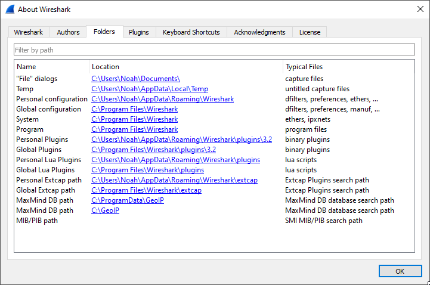

# FTC Robocol Wireshark Plugin
This [Wireshark](https://www.wireshark.org/) plugin will allow you to better analyze robocol traffic between the FIRST
Tech Challenge Robot Controller and Drvier Station apps.

## Prerequisites for capturing robocol traffic
* [Your WiFi adapter needs to be in monitor mode](https://wiki.wireshark.org/CaptureSetup/WLAN#Turning_on_monitor_mode)
    * [airmon-ng](https://www.aircrack-ng.org/doku.php?id=airmon-ng) is a useful tool for this
* You need to [set up Wireshark to decrypt the WiFi traffic](https://wiki.wireshark.org/HowToDecrypt802.11)
    * Note that the initial WiFi connection (the "4-way handshake") must be included in the capture, or this will not work.
    
## Installing the robocol plugin
1. From the About Wireshark window, select the folders tab, and click the link next to "Personal Lua Plugins".
    
2. Download <a href="https://raw.githubusercontent.com/REVrobotics/FTC-robocol-Wireshark-plugin/master/robocol.lua" download>
robocol.lua</a>, and put it in that folder.
3. Restart Wireshark.

Feel free to submit a bug report or a pull request, but please do not contact REV Robotics to ask for Wireshark help.

```
Copyright 2020 REV Robotics

This program is free software: you can redistribute it and/or modify
it under the terms of the GNU General Public License as published by
the Free Software Foundation, either version 2 of the License, or
(at your option) any later version.

This program is distributed in the hope that it will be useful,
but WITHOUT ANY WARRANTY; without even the implied warranty of
MERCHANTABILITY or FITNESS FOR A PARTICULAR PURPOSE.  See the
GNU General Public License for more details.

You should have received a copy of the GNU General Public License
along with this program.  If not, see <https://www.gnu.org/licenses/>.
```
